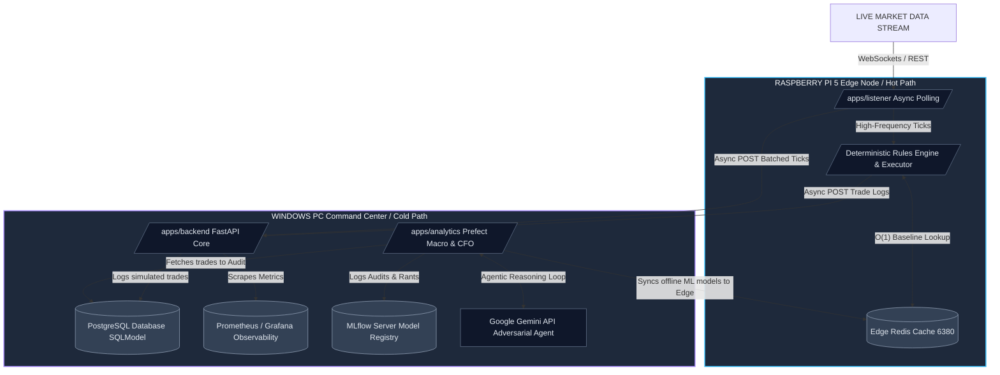

<div align="center">
  <h1>Brand Sniper</h1>
  <p><strong>Algorithmic Market Sniping & Macro Arbitrage Engine</strong></p>
  <p><em>A production-grade, distributed data and AI system engineered to detect real-time market pricing anomalies and forecast long-term macroeconomic asset trends.</em></p>
</div>

<p align="center">
  <a href="https://github.com/Criseda/brand-sniper-monorepo/actions/workflows/ci.yml">
    
  </a>
  <a href="https://www.python.org/downloads/release/python-3120/">
    
  </a>
  <a href="https://github.com/astral-sh/uv">
    
  </a>
  <a href="https://github.com/astral-sh/ruff">
    
  </a>
  <a href="http://mypy-lang.org/">
    
  </a>
</p>

---

**The platform's mission has evolved:** We utilize a lightning-fast **Deterministic Rules Engine (DRE)** on the hot-path to instantly paper-trade statistical anomalies, while an offline **Agentic AI Pipeline (The Adversarial CFO)** leverages Live Tools to independently audit those trades asynchronously.

---

## Features

- **High-Velocity Hot Path:** Real-time data streams evaluated by a Deterministic Rules Engine (DRE) in <5ms.
- **Agentic AI Audit (Cold Path):** Autonomous Adversarial CFO powered by Google Gemini to retrospectively audit trades.
- **Edge-to-Cloud Architecture:** Designed for hybrid deployment across Raspberry Pi 5 edge nodes and PC compute engines.
- **O(1) Data Lookup:** Sub-millisecond data windowing powered by an edge-local Redis cache.
- **Comprehensive Observability:** Built-in Prometheus metrics and Grafana dashboards for deep operational insights.

---

## System Architecture & Hardware Topology

The infrastructure is explicitly decoupled across two physical nodes to replicate an enterprise-grade hybrid-cloud network topology:



### 1. The Short-Term Anomaly Path (The Edge)
Running 24/7 inside Docker on the **Raspberry Pi 5**, the `/apps/listener` service consumes real-time market data ticks via REST polling and a **Node.js WebSocket sidecar** (for push-based Socket.IO feeds). It writes incoming vectors concurrently to a local Edge Redis hot-cache window, and instantly evaluates them. 

### 2. The Deterministic Rules Engine (The Hot Path)
When a statistical anomaly is detected, the **Deterministic Rules Engine (DRE)**—now residing entirely on the Edge Node—queries the Edge Redis in `O(1)` time (sub-millisecond latency) to validate the drop against long-term ML baselines. If verified, the local `PaperExecutor` executes the trade synchronously, totally bypassing the network boundary. **Average latency: <5ms.**

### 3. Observability (Grafana & Prometheus)
The Edge Node asynchronously POSTs the execution logs to the Windows backend. The backend increments memory-safe `prometheus_client` gauges and histograms. Prometheus scrapes this data on a schedule, and **Grafana** provides a stunning real-time visualization of simulated PnL.

### 4. The Adversarial CFO (The Cold Path)
To prevent Circular Feedback Loops, we built the **Adversarial CFO**.
Orchestrated by **Prefect**, this daily offline pipeline feeds the bot's simulated trades to Google's **Gemini**. The AI is armed with tool functions (`fetch_live_market_floor`, `search_macro_trends`) registered via **FastMCP**, allowing it to evaluate market context and macro trends. In the current prototype these tools return simulated adversarial data; a production deployment would integrate live API keys to scrape real-time market floors and search news/social feeds.
Its final grade and reasoning trace are logged immutably into **MLflow**. Prefect then syncs the newly evaluated ML baselines back across the network to the Edge Redis cache.

---

## Tech Stack

| Category | Technology |
|---|---|
| **Runtime** | Python 3.12 (Locked via `uv`) |
| **Package Management** | `uv Workspaces` (Unified root lockfile, independent microservice dependency resolutions) |
| **Database & Migrations** | PostgreSQL (`psycopg2`), **SQLModel**, and **Alembic** |
| **Cache** | Redis (Async key-value data-windowing) |
| **Orchestration & Tracking** | Prefect Server & MLflow |
| **AI Graph & Protocols** | Google Gemini & Model Context Protocol (FastMCP) |
| **Observability** | Prometheus & Grafana Stack |

---

## Setup & Installation Guide

This monorepo is designed to be plug-and-play using `.env.example` templates. PostgreSQL is configured for Azure Flexible Server by default; uncomment the postgres service in `deployments/windows-stack/docker-compose.yml` for local development.

### 1. Prerequisites
Ensure you have `uv` installed globally, along with `Docker` and `Docker Compose`.
*(Windows PowerShell installation for uv)*: `powershell -c "irm https://astral.sh/uv/install.ps1 | iex"`

### 2. Environment Variables
To make setup seamless, copy the `.env.example` file in the root directory to `.env` and fill in your keys:

```bash
cp .env.example .env
```
*(Repeat this for `apps/analytics/.env.example` and `apps/backend/.env.example` if specific microservice configuration is needed).*

### 3. Workspace Initialization
Run `uv sync --all-packages` from the project root. Because this is a monorepo workspace, you must use the `--all-packages` flag so `uv` resolves dependencies across all microservices simultaneously. This command creates a localized `.venv` and links the internal `shared-utils` library across all applications instantly:

```bash
uv sync --all-packages
```

### 4. Spin Up Infrastructure (Docker)
Initialize the foundational database, cache, tracking servers, and observability metrics layers.

**Windows Compute Node Stack:**
```bash
cd deployments/windows-stack
docker compose up -d
```
This single command spins up:
- **Grafana** (Port `3000`) - *Default Login: admin / admin*
- **Prometheus** (Port `9090`)
- **Prefect Server** (Port `4200`)
- **MLflow Tracking Server** (Port `5000`)

### 5. Database Migrations (Alembic)
Apply the SQL schemas to the live PostgreSQL instance:
```bash
cd deployments
uv run alembic upgrade head
```

---

## Running the Applications

### Start the Backend (API Core)
```bash
cd apps/backend
uv run python main.py
```
- API Docs: `http://localhost:8080/docs`
- Prometheus Metrics: `http://localhost:8080/metrics`

### Start the Edge Listener (DRE Hot Path)
```bash
cd apps/listener
uv run python main.py
```

### Run the Agentic CFO Pipeline
Once trades exist in the database, execute the adversarial evaluation:
```bash
cd apps/analytics
uv run python evaluate_performance.py
```
View the AI's reasoning artifact in **MLflow** at `http://localhost:5000`.

---

## Quality Assurance

This project enforces code quality through automated CI (GitHub Actions):

- **Linting**: `ruff check` — catches unused imports, syntax errors, and anti-patterns
- **Formatting**: `ruff format` — enforces consistent style (line-length 128, double quotes)
- **Type checking**: `mypy` — static type analysis across all application code
- **Testing**: `pytest` with `pytest-asyncio` — test suite covering all apps and shared utilities

All checks run automatically via GitHub Actions on every push and pull request to `main`.
Pull requests must pass all CI checks before merging. See [CONTRIBUTING.md](CONTRIBUTING.md) for the full development workflow.

```bash
# Run all quality checks locally
uv run ruff check
uv run ruff format --check
uv run mypy apps/backend/ apps/listener/ apps/analytics/
uv run pytest
```

---

## Contributing

See [CONTRIBUTING.md](CONTRIBUTING.md) for the development workflow, branch naming, quality checks, and pull request process. In short:

1. Branch from `main` (`feat/`, `fix/`, etc.)
2. Make changes following project conventions
3. Run quality checks (`ruff check`, `ruff format --check`, `mypy`, `pytest`)
4. Open a pull request against `main` — CI must pass before merging