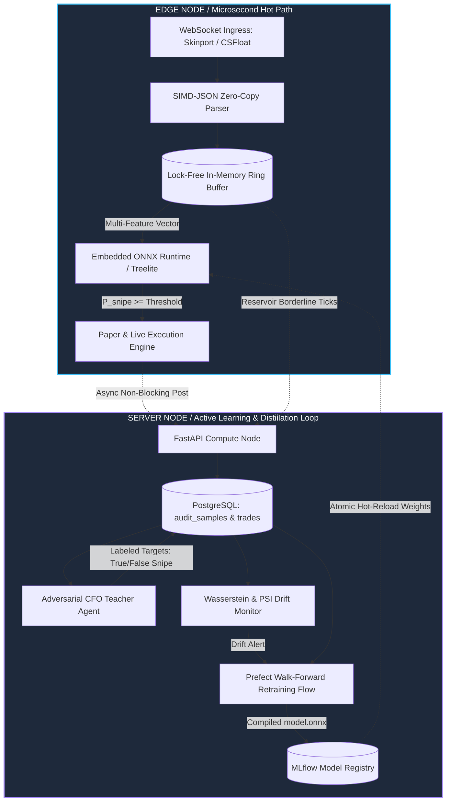

# Milestone 5: Edge-Inference & Distillation Engine — Active Roadmap

> [!IMPORTANT]
> **Milestone Lifecycle Notice**:
> This document is an active execution roadmap specifically for **Milestone 5 (Edge-Inference & Distillation Engine)**.
> Once all 11 issues in this milestone are implemented, validated, and merged into `main`:
> 1. This file (`docs/roadmap_edge_distillation.md`) is to be archived or deleted.
> 2. The permanent architectural patterns must be incorporated into [`docs/architecture.md`](docs/architecture.md).
> 3. [`AGENTS.md`](../AGENTS.md) and [`README.md`](../README.md) must be trimmed to remove the temporary milestone issue tables and updated to reflect the new steady-state system.

---

## 1. Executive Summary & Vision

The objective of Milestone 5 is to elevate Brand Sniper from a heuristic 1-variable Z-score scraper into an **institutional-grade Real-Time Edge ML & Active Learning System**.

This milestone bridges three architectural frontiers:
1. **Closing the Agentic Loop (Active Learning & Distillation)**:
   Transform the Adversarial CFO agent from a passive auditor into an automated **Teacher** that labels trade candidates and borderline near-misses. This continuously distills institutional decision logic into a lightweight **Student model** (LightGBM/MLP).
2. **In-Process Microsecond Edge Inference**:
   Eliminate inter-process communication hops and Redis TCP round-trips by building a unified compiled edge engine (in Rust) with in-memory lock-free ring buffers and in-process ONNX Runtime evaluation ($<50\mu\text{s}$ latency).
3. **Continuous MLOps & Distribution Drift Monitoring**:
   Implement statistical drift monitors (Wasserstein Distance & Population Stability Index) to detect macro market regime changes and automate model retraining with walk-forward temporal cross-validation.

---

## 2. End-to-End System Topology

---

## 3. Issue Sequence & Dependency Matrix

Every issue is strictly ordered. Agents and contributors must follow this sequence to ensure prerequisites and baseline benchmarks are established before dependent features are developed.

| Step | Issue | Title | Phase | Precondition | Key Artifact / Deliverable |
|:---:|:---:|:---|:---:|:---|:---|
| **1** | [#232](https://github.com/Criseda/brand-sniper-monorepo/issues/232) | `[EID-01] Reservoir Sampling for Borderline Ticks & Near-Misses` | Phase 1 | None | `audit_samples` DB table + async sampler in listener |
| **2** | [#233](https://github.com/Criseda/brand-sniper-monorepo/issues/233) | `[EID-02] CFO Oracle Labeling Pipeline: Generate Supervised Ground Truth` | Phase 1 | #232 | Automated CFO Teacher labeling tasks + versioned dataset |
| **3** | [#234](https://github.com/Criseda/brand-sniper-monorepo/issues/234) | `[EID-03] Walk-Forward Student Model Training & ONNX Compilation` | Phase 1 | #233 | `train_student.py` Prefect flow + `model.onnx` artifact |
| **4** | [#235](https://github.com/Criseda/brand-sniper-monorepo/issues/235) | `[EID-04] Market Regime & Distribution Drift Detection (Wasserstein / PSI)` | Phase 1 | #234 | Streaming drift monitor + auto-retraining trigger |
| **5** | [#175](https://github.com/Criseda/brand-sniper-monorepo/issues/175) | `[PERFORMANCE] Benchmark listener ingress-to-decision latency` | Phase 2 | None | 10k deterministic fixture harness in `apps/listener/benchmarks/` |
| **6** | [#236](https://github.com/Criseda/brand-sniper-monorepo/issues/236) | `[EID-05] In-Memory Ring Buffers & In-Process ONNX Inference (Python)` | Phase 2 | #175, #234 | In-memory circular buffer + Python ONNX hot-path ($<1\text{ms}$) |
| **7** | [#237](https://github.com/Criseda/brand-sniper-monorepo/issues/237) | `[EID-06] Unified Rust Daemon: Direct WebSocket & SIMD-JSON Parsing` | Phase 3 | #236 | `apps/edge-engine` scaffold + native WS client |
| **8** | [#238](https://github.com/Criseda/brand-sniper-monorepo/issues/238) | `[EID-07] Lock-Free In-Memory Sliding Windows & In-Process ORT (<50µs)` | Phase 3 | #237 | In-process ORT evaluation in Rust ($<50\mu\text{s}$) |
| **9** | [#239](https://github.com/Criseda/brand-sniper-monorepo/issues/239) | `[EID-08] Atomic Model Hot-Reloading & Latency Collapse Report` | Phase 3 | #238 | `arc_swap` model updates + `docs/benchmarks/latency_collapse_report.md` |
| **10** | [#33](https://github.com/Criseda/brand-sniper-monorepo/issues/33) | `[INGESTION] Expand Multi-Venue Arbitrage Scrapers (CSFloat & Steam)` | Phase 4 | #238 | CSFloat WebSocket + cross-market feature inputs |
| **11** | [#18](https://github.com/Criseda/brand-sniper-monorepo/issues/18) | `[FEATURE] Discord/Telegram integration` | Phase 4 | #238 | Real-time webhook notifications for $P_{\text{snipe}} > 0.85$ |

---

## 4. Technical Specifications & Guidelines

### Phase 1: The Closed Distillation Loop (Python)
* **Sampling Philosophy**: Avoid survivorship bias. Do not sample solely from approved trades. A background reservoir must sample ticks with $Z \in [-1.5, -2.0]$ and atypical float wear.
* **Feature Vector Definition**:
  1. `price_to_floor_ratio`: $\frac{P_{\text{tick}}}{P_{\text{live\_floor}}}$
  2. `price_to_30d_avg`: $\frac{P_{\text{tick}}}{\mu_{30d}}$
  3. `volatility_ratio_5m_1h`: $\frac{\sigma_{5m}}{\sigma_{1h}}$
  4. `wear_value`: Float wear $\in [0.0, 1.0]$
  5. `wear_tier_penalty`: Non-linear penalty factor based on boundary proximity (e.g. $0.069$ vs $0.071$)
  6. `sticker_premium_ratio`: $\frac{V_{\text{stickers}}}{P_{\text{tick}}}$
  7. `tick_velocity`: Order arrival rate per second
* **Walk-Forward Validation**: Prohibit random $K$-fold cross-validation. Splitting must preserve temporal order:
  $$\text{Train: } [t_0, t_k] \longrightarrow \text{Validate: } [t_k, t_{k+1}]$$
* **Statistical Drift**:
  - Continuous metrics: Wasserstein Distance $W_1(u, v) = \int_{-\infty}^{\infty} |U(x) - V(x)| dx$
  - Discrete/Categorical: $\text{PSI} = \sum (A_i - E_i) \times \ln\left(\frac{A_i}{E_i}\right)$

### Phase 2: Ingress Profiling & In-Memory Hot Path
* Follow the rigorous requirements of [Issue #175](https://github.com/Criseda/brand-sniper-monorepo/issues/175): zero live network dependency for the benchmark harness, 10,000 deterministic fixtures, and isolated stage attribution.
* In Python, replacing Redis Z-sets with an in-memory fixed-size circular buffer must eliminate 4-5 local TCP round-trips per tick.

### Phase 3: The Unified Microsecond Edge Engine (Rust)
* Directory: `apps/edge-engine/`
* Ingestion: Direct WebSocket via `tokio-tungstenite`.
* Deserialization: `simd-json` directly into cache-aligned structs.
* In-Process Inference: ONNX Runtime C API via `ort` crate.
* Zero-Downtime Reload: `arc_swap::ArcSwapOption` holding the active `ort::Session`.

---

## 5. Teardown & Transition Plan (Post-Milestone)

When Issue #18 is closed and Milestone 5 reaches 100% completion:
1. **Archive/Remove**: Delete `docs/roadmap_edge_distillation.md`.
2. **Update Core Architecture**: Move the final system architecture and latency benchmarks into [`docs/architecture.md`](docs/architecture.md).
3. **Trim `AGENTS.md`**: Remove the active milestone issue table from [`AGENTS.md`](../AGENTS.md) and reset the guide for standard feature maintenance.
4. **Update `README.md`**: Reflect v2.0 capabilities and production benchmarks in the top-level documentation.
