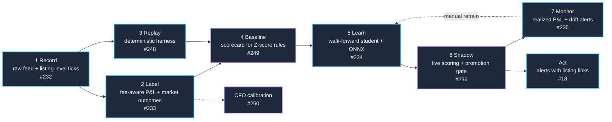

# Milestone 5: Proven Edge — Active Roadmap

> [!IMPORTANT]
> **Milestone Lifecycle Notice**:
> This document is the active execution roadmap for **Milestone 5 (Proven Edge: Outcome-Labeled Learning Loop)**.
> Once all scheduled issues in this milestone are implemented, validated, and merged into `main`:
> 1. This file (`docs/roadmap_proven_edge.md`) is to be archived or deleted.
> 2. The permanent architectural patterns must be incorporated into [`docs/architecture.md`](architecture.md).
> 3. [`AGENTS.md`](../AGENTS.md) and [`README.md`](../README.md) must be trimmed to remove the temporary milestone tables and updated to reflect the new steady-state system.

---

## 1. Direction

Brand Sniper should be able to **prove its edge**: every trade decision backed by recorded market data,
labeled by what the market actually did afterwards, and measured as fee-aware P&L before any smarter
model or faster runtime is adopted. The goal is a system that is both a credible showpiece and able to
make money, with manual execution (a human following an alert link) as the first step towards acting on it.

### Where the system is today

- The listener flags listings about 2 sigma below a baseline and paper-trades them.
- Profit is estimated as `baseline.latest_price_cents - price`: no seller fee, no trade-hold/holding period, no liquidity.
- Only `market_hash_name`, `price_cents`, and `timestamp` are persisted per tick. Float, stickers, pattern,
  listing ID, and non-`listed` feed events are discarded.
- The Adversarial CFO scores trades daily, but its verdicts are never checked against outcomes, and it sees
  post-decision prices (uncontrolled look-ahead).

Nothing in the system currently knows whether a trade would have made money. This milestone fixes that first.

---

## 2. The Loop

---

## 3. Issue Sequence & Dependency Matrix

| Step | Issue | Title | Depends on | Key deliverable |
|:---:|:---:|:---|:---|:---|
| **1** | [#232](https://github.com/Criseda/brand-sniper-monorepo/issues/232) | `[PE-01]` Raw feed capture & listing-level tick persistence | None | `feed_events` table, extended `LiveMarketTick`, feed-schema note |
| **2** | [#233](https://github.com/Criseda/brand-sniper-monorepo/issues/233) | `[PE-02]` Fee-aware P&L function & market-outcome labeling | #232 | Shared P&L function, `listing_outcomes` table, labeler flow |
| **3** | [#248](https://github.com/Criseda/brand-sniper-monorepo/issues/248) | `[PE-03]` Deterministic replay & backtest harness | #232 | Replay CLI, strategy interface, decision logs |
| **4** | [#249](https://github.com/Criseda/brand-sniper-monorepo/issues/249) | `[PE-04]` Baseline scorecard for the current Z-score DRE | #233, #248, #259 | `docs/benchmarks/baseline_scorecard.md` |
| **5** | [#175](https://github.com/Criseda/brand-sniper-monorepo/issues/175) | `[PE-05]` Ingress-to-decision latency benchmark (Rust decision gate) | #248 | Latency attribution report + budget |
| **6** | [#234](https://github.com/Criseda/brand-sniper-monorepo/issues/234) | `[PE-06]` Shared feature module & walk-forward student model (ONNX) | #249 | `train_student.py`, registered ONNX candidate |
| **7** | [#236](https://github.com/Criseda/brand-sniper-monorepo/issues/236) | `[PE-07]` Shadow-mode in-process ONNX scoring with promotion gate | #234, #175 | Shadow scoring in listener, shadow-period report |
| **8** | [#250](https://github.com/Criseda/brand-sniper-monorepo/issues/250) | `[PE-08]` CFO calibration experiment | #233, #249 | `docs/benchmarks/cfo_calibration.md` |
| **9** | [#235](https://github.com/Criseda/brand-sniper-monorepo/issues/235) | `[PE-09]` Realized-performance & feature drift monitoring | #236 | Prometheus metrics, alert rules |
| **10** | [#18](https://github.com/Criseda/brand-sniper-monorepo/issues/18) | `[PE-10]` Discord/Telegram alerts with direct listing links | #232 | Alerting with one-click listing links |
| **11** | [#33](https://github.com/Criseda/brand-sniper-monorepo/issues/33) | `[PE-11]` CSFloat venue: listings, fees, baselines | #259, #260 | CSFloat listing-level ticks, `VenueFees`, baselines |
| **12** | [#259](https://github.com/Criseda/brand-sniper-monorepo/issues/259) | `[PE-12]` Current venue-aware baselines, loaded at listener startup | #232 | Baselines from Skinport sales history, dated history, startup load, health metric |
| **13** | [#260](https://github.com/Criseda/brand-sniper-monorepo/issues/260) | `[PE-13]` Cross-venue fee-aware P&L | #233 | Separate buy-venue and sell-venue fees in `shared_utils.pnl` |
| **14** | [#261](https://github.com/Criseda/brand-sniper-monorepo/issues/261) | `[PE-14]` Waxpeer venue: live feed, fees, baselines | #259, #260 | Waxpeer listing-level ticks, `VenueFees`, baselines |

**Parallelism:** after #232, the tracks #233, #248, #259, and #18 can proceed concurrently. #259 comes first in practice: the live baselines are pre-crash Kaggle Steam prices and the edge has had none loaded since July 2026 (see [`data_sources.md`](data_sources.md)), so #249 would mostly measure broken baselines without it. New venues (#33, #261) wait for #259 and #260. #250 can run alongside #234 and #236.

**Parked (not scheduled):** [#237](https://github.com/Criseda/brand-sniper-monorepo/issues/237),
[#238](https://github.com/Criseda/brand-sniper-monorepo/issues/238),
[#239](https://github.com/Criseda/brand-sniper-monorepo/issues/239) (compiled Rust edge engine). Whether a
compiled runtime is worth it will be decided in a dedicated session that reviews the #175 evidence and the
#236 scoring cost. Do not start these issues before that decision.

---

## 4. Technical Specifications

### 4.1 Recording (#232)
- Record every feed event; do not sample. At Skinport's listing rate full capture is cheap, and sampling a
  Z-score band would condition training data on the old rule.
- Persist raw payloads (JSONB) in an append-only `feed_events` table via the existing durable batch path.
- Listing-level ticks carry listing ID, event type, float, pattern, stickers, and a listing link/slug.
- All models live in `packages/shared_utils/src/shared_utils/models.py`.

### 4.2 Fee-aware P&L (#233)
One pure function in `shared_utils` (`shared_utils/pnl.py`: `net_resale_margin_cents`), used by the listener
estimate, the labeler, backtests, and alerts:

$$\mathrm{net\_margin} = P_{\text{resale}} - \mathrm{fee}(P_{\text{resale}}) - P_{\text{buy}}$$

Money is integer cents and fees are integer basis points; the fee is rounded up to the next cent, so the
margin is never overstated. Parameters live in a `VenueFees` value (`SKINPORT_FEES` for Skinport):

| Parameter | Skinport value | Source |
|:---|:---|:---|
| Seller fee | 8%, or 6% when the resale price is at least USD 1000 | [Skinport: reduced fee for high-tier items](https://skinport.com/blog/reduced-fee-high-tier-items) |
| Buyer fee | none on the listing price | Skinport checkout (payment-method fees are not modeled) |
| Trade hold | 7 days | Steam trade protection on traded CS2 items (up to 8 days worst case) |
| Minimum margin | 0 cents | Project default; raise it to demand a cushion |

Private sales (2% fee) are not modeled. Re-check these values when Skinport changes its fee page.

Fees are never implied. Every caller passes a `VenueFees` explicitly, looked up with `fees_for(venue)`,
which raises `UnknownVenueError` for a venue without a registered schedule. `MarketTick` carries its
`venue`, and the listener refuses to start for a venue that has no schedule. **Adding a venue** means
defining its `VenueFees` (with sources) in `pnl.py` and registering it in `VENUE_FEES`.

Paper trades record how their estimate was computed in `simulated_trades.profit_estimate_basis`:
`gross` for trades written before the shared function existed (baseline price minus buy price, no fees),
`net_of_seller_fee` after. `estimated_profit_cents` is `NULL` when the listener had no baseline price to
resell against. Never aggregate estimates across bases.

### 4.3 Outcome labels (#233)
Triple-barrier style labels for each `listed` sale, written by `apps/analytics/label_outcomes.py`
(Prefect flow `listing-outcome-labeler`) to `listing_outcomes`, keyed by (`source`, `listing_id`, `label_version`).

**Label version `v1`** (for a listing first seen at time $t$ at price $p$):

| Field | Definition |
|:---|:---|
| `listed_at`, `listed_price_cents` | First sighting of the `productId` as `listed` (edge receive time). Repeated sightings are deduplicated; the earliest wins. |
| `comparable_sales` | Sold sales of the same versioned `market_hash_name` (wear and phase included), other than this listing, received in $[t + \text{hold},\ t + H]$. Each sold `productId` counts once. |
| `resale_price_cents` | Lower median of the comparable sale prices. The single best sale is not used: it rewards outliers a seller could not count on. |
| `resale_net_margin_cents` | `net_resale_margin_cents(p, resale_price_cents)`. |
| `is_profitable` | margin $\geq$ minimum margin. `NULL` (neutral) when there are fewer than 3 comparable sales. |
| `listing_sold_within_s` | Seconds from $t$ to this `productId`'s first `sold` sighting, if it falls in $[t,\ t + H]$. |
| `sale_censored` | True when this listing was not seen to sell by $t + H$. The feed never reports cancellations or price changes, and crash loss (#252) can drop events, so this means "not seen to sell", never "did not sell". It is not a negative label. |
| `label_available_at` | $t + H$. No training, evaluation, or monitoring job may use a label before this time. |

Parameters: hold 7 days, horizon $H$ = 14 days, minimum 3 comparable sales, USD prices only.
The flow only labels a listing once $t + H$ plus a 1-hour settle time (for edge batches still in flight)
has passed, and only fetches sales up to $t + H$. It upserts, so re-running any date range is safe; on a
conflict the earliest sighting wins. Float tiers inside a wear bucket, stickers, and pattern premiums are
not part of `v1` comparables; add them as a new label version.

Run it daily over the last few matured days (`uv run python label_outcomes.py`), or over an explicit
range (`--start 2026-09-24 --end 2026-10-01`).

Labels are versioned (`label_version`); changing the definition creates a new version rather than rewriting history.

### 4.4 Replay harness (#248)
- Replays recorded events in timestamp order through the **real** listener decision code via injectable stores.
- Strategy interface: `decide(tick, context) -> Decision(score, approve, reason)`.
- Deterministic: identical input produces byte-identical decision logs. Used for backtests, parity, and #175.
- Usage, input caveats (baseline look-ahead, approximate REST snapshot times), and the log format: [`docs/backtesting.md`](backtesting.md).

### 4.5 Feature contract (#234)
- One shared feature module used by replay, training, and the listener. Never reimplement features per consumer.
- Every feature must be computable from data available at decision time.
- Initial set: `price_to_window_mean`, `z_score`, `z_source`, `price_to_30d_avg`, `price_to_support_floor`,
  `macro_cv`, `avg_volume_30d`, `float_value`, `float_tier_boundary_distance`, `sticker_value_ratio`,
  `listings_per_hour_item`. Changes to this list update this document and bump the feature version logged in MLflow.

### 4.6 Validation and promotion (#234, #236)
- Walk-forward temporal validation only (expanding or rolling windows); random K-fold is prohibited:
  $$\text{Train: } [t_0, t_k] \longrightarrow \text{Validate: } [t_k, t_{k+1}]$$
- Metrics: ROC-AUC, PR-AUC, Brier score, calibration, plus precision and realized net P&L at the operating threshold.
- A model becomes a **candidate** only if it beats the #249 baseline out of sample.
- A candidate is **promoted** from shadow to deciding only after a documented shadow period in which it beats the rules on live, realized outcomes. The Z-score path remains the fallback.

### 4.7 Monitoring (#235)
- Primary: rolling realized precision, net P&L, and calibration as labels arrive.
- Diagnostic: Wasserstein distance $W_1(u, v) = \int |U(x) - V(x)|\,dx$ for continuous features and
  $\text{PSI} = \sum (A_i - E_i) \ln(A_i / E_i)$ for binned features, against the training distribution.
- Alert on decay or drift; do not auto-retrain or auto-promote.

---

## 5. Anti-Patterns

- **LLM output as ground truth.** The CFO is evaluated against market outcomes (#250); it never produces training labels.
- **Look-ahead.** Any feature, label, or LLM context that uses information after the decision timestamp.
- **Naive profit.** Any profit number that skips the shared fee-aware P&L function.
- **Feature forks.** Computing features separately for training and serving.
- **Targets chosen to justify a technology.** Latency budgets come from #175 evidence, not from a preferred runtime.
- **Promoting without a baseline.** No model reaches the hot path without beating #249 out of sample and in shadow mode.

---

## 6. Teardown & Transition Plan (Post-Milestone)

When the scheduled issues are closed:
1. **Archive/Remove**: delete `docs/roadmap_proven_edge.md`.
2. **Update Core Architecture**: move the recording, labeling, replay, and promotion patterns, plus the scorecards, into [`docs/architecture.md`](architecture.md).
3. **Trim `AGENTS.md`**: remove the active milestone table.
4. **Update `README.md`**: report the baseline and model scorecards and the alerting workflow.
5. **Parked issues**: #237, #238, #239 are resolved by the Rust decision session, independent of this milestone's closure.
